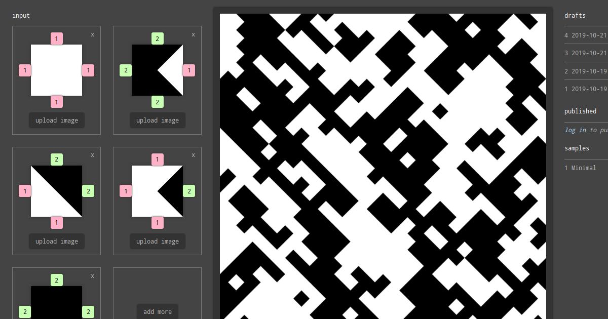

# Tiles

Tiles is a tool to create large compositions from smaller images. The input
images are repeated, rotated, and assembled according to specified rules.



## Installation

### Mac

``` shell
$ brew install python
$ pip install pipenv
$ make setup
```

### Arch Linux

``` shell
# pacman -S pipenv
$ make setup
```

### Other systems

Install these dependencies manually:

- Python 3.7
- pipenv

Then run:

``` shell
$ make setup
```

## Usage

Start a development server

``` shell
$ make run
```

Create database:

``` shell
$ make create-db
```

Create database tables, superuser, and populate the db with fixtures:

``` shell
$ make migrate create-superuser populate-db
```

Start a development server with production settings.

Dependencies:

- pwgen

``` shell
$ make run-prod
```

## Development

### Installation

``` shell
make setup-dev
```

### Testing and linting

``` shell
make test
make lint
```

### Help

``` shell
make help
```

## Contributing

__Feel free to remix this project__ under the terms of the [Apache License,
Version 2.0](http://www.apache.org/licenses/LICENSE-2.0).
