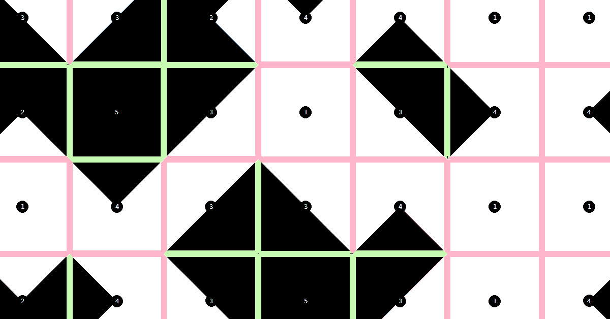

# Tessellation

Tessellation is a tool to arrange tiles (several small images) into one large
composition.

Tessellation takes the input images and then repeats, rotates and arranges them
in such a way that their matching edges appear side by side. The resulting
composition is diverse yet smooth. This is similar to the [Wang tiles
problem](https://en.wikipedia.org/wiki/Wang_tile).



## Installation

### Mac

``` shell
$ brew install python
$ pip install pipenv
$ make setup
```

### Arch Linux

``` shell
# pacman -S pipenv
$ make setup
```

### Other systems

Install these dependencies manually:

- Python 3.7
- pipenv

Then run:

``` shell
$ make setup
```

## Usage

Start a development server

``` shell
$ make run
```

Create database:

``` shell
$ make create-db
```

Create database tables, superuser, and populate the db with fixtures:

``` shell
$ make migrate create-superuser populate-db
```

Start a development server with production settings.

Dependencies:

- pwgen

``` shell
$ make run-prod
```

## Development

### Installation

``` shell
make setup-dev
```

### Testing and linting

``` shell
make test
make lint
```

### Help

``` shell
make help
```

## Contributing

__Feel free to remix this project__ under the terms of the GNU General Public
License version 3 or later. See [COPYING](./COPYING) and [NOTICE](./NOTICE).
